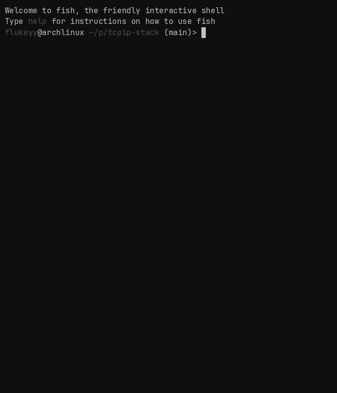

# tcpip-stack



A userspace TCP/IP stack implemented in C, built on top of a Linux TAP virtual
network device. Implements Ethernet, ARP, IPv4, and ICMP from scratch — no
kernel networking, no libc socket calls, just raw bytes.

---

## Demo

Responding to `ping` with a custom ICMP echo reply, constructed entirely in
userspace:

```
$ ping 10.0.0.2
PING 10.0.0.2 (10.0.0.2) 56(84) bytes of data.
64 bytes from 10.0.0.2: icmp_seq=1 ttl=64 time=0.151 ms
64 bytes from 10.0.0.2: icmp_seq=2 ttl=64 time=0.052 ms
64 bytes from 10.0.0.2: icmp_seq=3 ttl=64 time=0.079 ms
64 bytes from 10.0.0.2: icmp_seq=4 ttl=64 time=0.095 ms
64 bytes from 10.0.0.2: icmp_seq=5 ttl=64 time=0.087 ms
64 bytes from 10.0.0.2: icmp_seq=6 ttl=64 time=0.217 ms

6 packets transmitted, 6 received, 0% packet loss
rtt min/avg/max/mdev = 0.052/0.113/0.217/0.054 ms
```

---

## Architecture

```
  ping 10.0.0.2
       │
       ▼
 ┌─────────────┐
 │  Linux TAP  │  /dev/net/tun  (virtual network device)
 └──────┬──────┘
        │  raw Ethernet frames
        ▼
 ┌─────────────┐
 │   eth.c     │  parse EtherType → dispatch to ARP or IPv4
 └──────┬──────┘
        │
   ┌────┴────┐
   ▼         ▼
 ┌─────┐  ┌─────┐
 │arp.c│  │ip.c │  ARP: who-has/is-at, cache
 └─────┘  └──┬──┘  IPv4: header parse, checksum, dispatch
             │
        ┌────┴────┐
        ▼         ▼
     ┌──────┐  ┌─────┐
     │icmp.c│  │tcp.c│  ICMP: echo request/reply (✓)
     └──────┘  └─────┘  TCP: in progress
```

Each layer hands the payload pointer and remaining length down to the next.
No dynamic dispatch, no vtables — just a switch on the protocol field.

---

## How it works

### TAP device

The stack opens `/dev/net/tun` in TAP mode (`IFF_TAP | IFF_NO_PI`), which
gives it a file descriptor that delivers raw Ethernet frames. Every `read()`
returns exactly one frame; every `write()` injects one frame back into the
kernel's networking path.

### Ethernet (layer 2)

Frames are parsed by overlaying a `struct eth_hdr` onto the raw bytes and
reading the EtherType field to route to the correct handler. No copying —
just pointer reinterpretation.

### ARP

Incoming ARP requests are parsed and, if addressed to our IP, replied to
with our MAC. A fixed-size cache maps IP → MAC for use by the IP layer when
constructing outgoing frames. The sender's mapping is learned from every
ARP packet seen, not just replies.

### IPv4

The IPv4 header is parsed and the `protocol` field used to dispatch to ICMP
or (later) TCP. Header length is extracted from the `ver_ihl` field and used
to find the payload start. Outgoing packets have their checksum computed
using the standard one's complement algorithm (RFC 791).

### ICMP

Echo requests (type 8) are replied to by copying the full ICMP payload
verbatim and setting type to 0. Both the IPv4 and ICMP checksums are
recomputed on the outgoing reply. The result is a valid ping response
indistinguishable from a kernel reply.

---

## Build

**Requirements:** Linux, GCC, a TAP-capable kernel (standard on any modern
distro).

```bash
git clone https://github.com/flukeyy-glitch/tcpip-stack
cd tcpip-stack/src
gcc -o stack main.c arp.c ip.c icmp.c
```

---

## Run

**Terminal 1** — start the stack:
```bash
sudo ./stack
```

**Terminal 2** — bring up the interface and test:
```bash
sudo ip addr add 10.0.0.1/24 dev tun0
sudo ip link set tun0 up
ping 10.0.0.2
```

The stack claims IP `10.0.0.2` on the `10.0.0.1/24` subnet. You can change
`OUR_IP_STR` and `OUR_MAC` in `main.c` to use different addresses.

---

## Progress

| Phase | What | Status |
|-------|------|--------|
| 1 | TAP device + Ethernet frame parsing | ✅ done |
| 2 | ARP request/reply + cache | ✅ done |
| 3 | IPv4 parsing + ICMP echo reply | ✅ done |
| 4 | TCP (3-way handshake, reliable delivery, teardown) | 🔧 in progress |

---

## Code structure

```
src/
├── main.c      TAP device setup, main read loop, Ethernet dispatch
├── arp.c/h     ARP parsing, reply, and IP→MAC cache
├── ip.c/h      IPv4 header parsing, checksum, protocol dispatch
├── icmp.c/h    ICMP echo request/reply
└── tcp.c/h     TCP state machine (in progress)
```

---

## References

- RFC 791 — Internet Protocol (IPv4)
- RFC 792 — Internet Control Message Protocol (ICMP)
- RFC 826 — Address Resolution Protocol (ARP)
- RFC 793 — Transmission Control Protocol (TCP)
- [Beej's Guide to Network Programming](https://beej.us/guide/bgnet)
- [Let's code a TCP/IP stack — Sam Jansen](https://www.saminiir.com/lets-code-tcp-ip-stack-1-ethernet-arp/)
- [Linux kernel TUN/TAP documentation](https://www.kernel.org/doc/Documentation/networking/tuntap.txt)

---

## What's missing / known limitations

- No TCP yet (phase 4)
- IPv4 checksum verification disabled on rx due to Linux TAP checksum
  offloading — outgoing checksums are always computed correctly
- No IPv6 support
- ARP cache has no expiry — entries persist for the lifetime of the process
- No IP fragmentation support
- Single-threaded — one connection at a time
